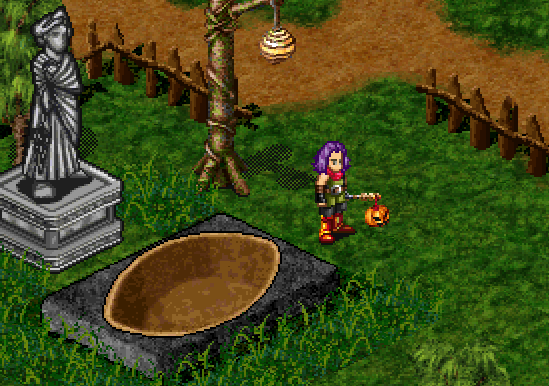

# Medenia

[Play Here](https://stevenwithaph.github.io/medenia/)

A [Dark Ages](https://www.darkages.com/index.html) private client / server written with [Phaser](https://github.com/phaserjs/phaser) and [Svelte](https://github.com/sveltejs/svelte)



## Requirements

bun@^1.1.17

## Running Locally

Clone this repo and install dependancies using npm:

```sh
bun install
```

Clone both /apps/client/.env.example and /apps/server/.env.example to .env

Run from root:

```sh
bun run dev
```

This will start the client, the server and a file server for the assets.

If you want to just run the client or server, run the same command but in their respective workspace

```sh
/apps/client
/apps/server
```

## Inspiration

[Chaos Server](https://github.com/Sichii/Chaos-Server)

[Hybrasyl](https://github.com/hybrasyl/server)

[DaLib](https://github.com/eriscorp/dalib)
